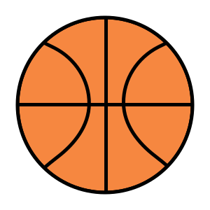
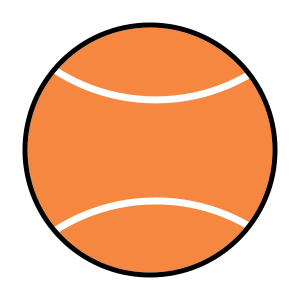

# DAW-Proiect-PHP

 

**Website**

https://vsebastian.alwaysdata.net/  
Email: demo@gmail.com  
Parola: demo

**Scurta Descriere**

Site-ul afiseaza date despre `rezultatele diferitor concursuri sportive`. Exista conturi de utilizator (autentificare prin formular) si de admin (poate adauga/sterge concursuri).

**Functionalitati**

- Se pot vizualiza concursurile dupa sport
- Se pot vizualiza cele mai recente concursuri
- Utilizatorii pot salva diferite concursuri; vor fi notificati cu update-uri pentru acestea
- Se poate accesa profilul unui sportiv, afisand concursurile la care a participat acesta

**Baza de Date**

`USERS` (id, nume, prenume, email, parola)  
`CONCURSURI` (id, nume, sport, data)  
`SPORTIVI` (id, nume, prenume, tara, data_nasterii)  
`A_PARTICIPAT` (id_sportiv, id_concurs, loc, premiu)  
`NOTIFICARI` (id_user, id_concurs)
